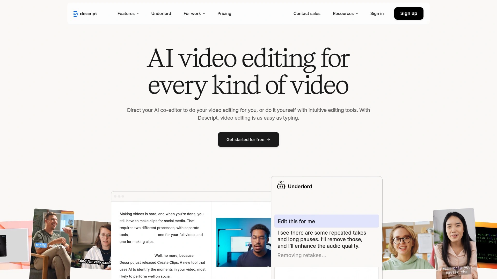
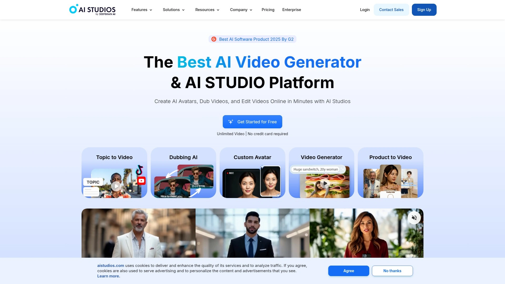

# Top 12 Best AI Video Generation Tools in 2025

Staring at a blank screen wondering how to turn your ideas into actual videos without film school or a production crew? AI video generators just flipped the script on content creation, letting anyone transform text prompts, images, and wild concepts into polished videos that actually look professional. Whether you're building a YouTube empire from your bedroom or trying to scale marketing content without burning budgets, these platforms handle everything from scriptwriting to final render.

***

## **[Kaiber AI](https://kaiber.ai)**

The most artist-friendly AI video platform that turns creative chaos into stunning visual storytelling without technical barriers.

Kaiber AI launched Superstudio in October 2024, creating a unified creative ecosystem where musicians, visual artists, and designers generate images and videos through an intuitive Canvas workspace. The platform excels at transforming text prompts, existing images, and audio files into dynamic animations with artistic styles that actually respect your creative vision. What makes Kaiber stand out is the audio-reactive video generation—your music literally drives the visual motion, making it perfect for music videos and experimental content.

The Canvas feature provides an expansive workspace where you integrate multiple media types, mixing images, videos, and sound elements into complex projects. You can animate static photos, transform existing videos with new artistic styles, or build entirely new visual content from scratch. The Motion tool brings still images to life with AI-powered animation that looks natural rather than robotic.

Kaiber works beautifully for creators who value artistic expression over corporate polish. The platform doesn't train generative models on your content without permission, respecting creator rights in ways larger competitors ignore. Plans start after a free trial, with interface options including both web and mobile apps for iOS. The video generation process offers extensive customization through style settings, allowing you to dial in exactly the aesthetic you want.

***

## **[Runway ML](https://runwayml.com)**

Advanced generative AI video platform trusted by filmmakers who need cinematic quality and precise control.

Runway delivers professional-grade video generation with its Gen-4 model, producing ultra-realistic content with detailed physics and natural camera motion. The platform handles text-to-video, image-to-video, and video-to-video transformations, giving creators multiple entry points depending on their source material. Gen-4 specifically excels at cinematic storytelling with dynamic camera movements and realistic parallax effects that make scenes feel three-dimensional.

You get precise frame control through the End Frame feature, letting you lock specific visual targets for consistent sequences. This matters when building narrative content where continuity actually counts. The platform supports high-end applications like commercial production, film pre-visualization, and realistic storytelling that demands accuracy.

Character consistency works across different scenes and lighting conditions using single reference images, crucial for maintaining visual coherence throughout longer projects. Runway's tools appeal to professionals who need reliability over novelty—the kind of creators making content that clients actually pay for. Pricing runs around $12 per minute of generated video, positioning this firmly in the professional tier.

***

## **[Synthesia](https://www.synthesia.io)**

Enterprise-focused AI video platform with 140+ languages and photorealistic avatars for scalable business content.

Synthesia transforms text into videos featuring AI avatars that speak, gesture, and express emotions naturally across 140 languages. Over 50,000 businesses use this platform for learning and development, sales enablement, technical training, and customer service videos. The tool eliminates needs for microphones, cameras, actors, or studios—just type your script and select an avatar.

You can create custom AI avatars that mirror your own appearance and voice, maintaining brand consistency while scaling video production exponentially. The platform automatically syncs chosen languages to avatar lip movements, making localization seamless rather than painful. Screen recording capabilities let you capture demos with instant transcripts that remove filler words and awkward pauses.

Collaboration happens in real-time with team commenting and review features built directly into the workflow. Videos export in SCORM format for learning management system integration, and analytics track views, drop-offs, and completion rates. The enterprise positioning means robust security, unlimited team members, API access, and dedicated support. This works best for companies producing high volumes of training or communication videos at scale.

***

## **[InVideo AI](https://invideo.io/make/ai-video-generator/)**

Beginner-friendly text-to-video generator with AI-powered scripts, voiceovers, and automated editing for fast content production.

InVideo AI writes scripts, adds AI-generated visuals, includes voiceovers, subtitles, and music automatically from simple text prompts. The platform serves 25 million customers across 190 countries, removing the learning curve that bogs down traditional video editors. You specify video length, target platform, and voiceover accent, then watch as AI assembles publish-ready content.

The magic box editing feature lets you modify videos with text commands like "change the accent" or "add a funny intro" without touching timelines or layers. This speeds up iteration cycles dramatically compared to manual editing software. InVideo AI v3.0 generates both images and videos internally, eliminating juggling between multiple AI tools.

Realistic AI voices understand emotional context behind words, delivering human-sounding narration in over 50 languages. The platform integrates with Google's Veo 3.1 model for text-to-video generation, accessing cutting-edge capabilities without separate subscriptions. Free trials let you test features before committing, and the interface works well for social media content, marketing clips, and explainer videos.

***

## **[Pika AI](https://pika.art)**

Innovative video generator with unique effects that manipulate objects in surreal ways for creative experimentation.

Pika AI excels at converting text prompts and images into videos across multiple styles including cinematic, animated, and cartoonish aesthetics. The standout feature is Pikaffects—special effects that let you inflate, melt, explode, squash, crush, or even "cake-ify" objects within videos. These creative tools produce results you genuinely can't achieve with traditional editing software.

Pika 2.0 introduced enhanced video rendering with cinematic effects and improved processing speeds, delivering top-quality output faster than previous versions. The user-friendly interface simplifies video creation even for complete beginners, with intuitive controls that don't require technical expertise. You can adjust video dimensions, modify elements like clothing and environments, and control length through straightforward tools.

Both web and mobile accessibility mean you work on projects from any device without platform restrictions. The versatile editing capabilities handle Text-to-Video, Image-to-Video, and Video-to-Video conversions, letting you repurpose existing content into new formats. Pika Labs raised $135 million in funding by June 2024, signaling serious industry confidence in their approach.

***

## **[HeyGen](https://www.heygen.com)**

AI avatar video creator that turns photos and voice into digital twins for consistent personal branding.

HeyGen generates hyper-realistic avatar videos from short recordings of yourself, creating a digital presenter that mirrors your appearance and expressions. The platform simplifies professional video creation without requiring camera work—just upload a video or photo, record voice, or input text. Avatar 3.0 produces ultra-realistic results with natural movements and spot-on lip sync.

Video Creation Shortcuts and Video Agent features make production faster than ever, letting AI avatars create content for you around the clock. You can design avatars through text prompting, describing the style you want without needing studio equipment. The tool works perfectly for solopreneurs, business owners, content creators, and marketers who want consistent video presence without constant filming.

HeyGen launched in 2020 by Joshua Xu and Wayne Liang, recently adding AI Video Generator that converts text prompts or single images into high-quality videos. Translation and multilingual voiceover features expand global reach automatically. Free plans include basic text-to-video, AI subtitles, and avatar videos, while advanced features require paid subscriptions. Integration with Canva brings HeyGen avatars directly into design workflows.

***

## **[Luma Dream Machine](https://lumalabs.ai/dream-machine)**

Fast image and video AI with conversational prompting and consistent character generation for creative exploration.

Luma Dream Machine lets you ideate, visualize, create videos, and share ideas using powerful image and video models available on iOS. The new image model is specifically trained for designers and creators who build worlds and stories, offering high creativity and personalization options. You reference anything by bringing your style, previous works, and ideas into Dream Machine, instructing with up to four images plus text simultaneously.

Consistent character generation works from single face images, letting you create infinitely varied images and videos of the same person across different settings. The Modify feature edits both images and videos by describing changes conversationally rather than using complex editing tools. Creative Query and Brainstorm features help when inspiration runs dry, building on your best ideas automatically.

Boards organize projects visually, and you share them to show behind-the-scenes processes or collaborate with others. The extend function seamlessly adds more frames to match existing motion, useful for lengthening clips without jarring transitions. Pricing includes a free plan plus paid tiers with priority processing, and special promotional codes occasionally offer months of free premium access. Tens of millions of users already create with Dream Machine.

***

## **[Fliki](https://fliki.ai/features/text-to-video)**

Multilingual text-to-video platform with 2,000+ AI voices and character consistency across 80+ languages.

Fliki converts text scripts into scroll-stopping video content with voice cloning, consistent characters, and customizable AI avatars. The platform serves over 50,000 companies, handling everything from TikTok shorts to professional explainers without steep learning curves. You create high-quality videos in minutes for YouTube, training, or marketing by matching scenes to text with AI assistance.

Voice selection offers 2,000+ lifelike options across 80+ languages, and you can clone your own voice for personalized branding. Character consistency maintains visual continuity across scenes, crucial for storytelling that spans multiple segments. The four-step process involves inputting text, personalizing AI voice, generating visuals, and reviewing before export.

Fliki supports MP4 and MOV video formats plus MP3 and WAV audio exports, ensuring compatibility with all major platforms. Advanced AI avatars act as presenters with synchronized lip-sync, perfect for tutorial and explainer content. Multilingual support lets you localize scripts and generate voiceovers in different languages within single projects, expanding global reach without extra production costs.

---

## **[Pictory](https://pictory.ai)**

Script-based video creator that transforms blog posts and articles into social media content automatically.

Pictory AI turns text-based content like blog posts, articles, and scripts into engaging videos with visuals, voiceovers, and subtitles. The platform works perfectly for YouTube automation, allowing creators to generate videos from scripts without extensive editing skills. Four core features include script-to-video, article-to-video, visuals-to-video, and editing video with text transcripts.

Text-based editing lets you delete video sections just by editing the transcript rather than fumbling with timelines. This makes complex edits accessible to non-technical users who understand documents better than video software. Pictory automatically adds subtitles, resizes content for different platforms, and swaps background visuals with single clicks.

Templates and aspect ratios optimize content for Instagram, YouTube Shorts, TikTok, and other platforms without recreating projects. The tool removes silences and filler words from recorded footage automatically, cleaning up presentations and demos efficiently. Customization options let you adjust scenes, visuals, audio, captions, and branding to match your style. Free trials test features before subscribing, and the web platform works on mobile browsers despite lacking dedicated apps.

***

## **[Descript](https://www.descript.com)**

Text-based video editor with AI voice cloning and regeneration that fixes mistakes by typing.

Descript revolutionizes editing by letting you modify videos through transcript editing—change the text and the video updates automatically. Wildly useful AI tools include green screen background removal, eye contact correction that makes you look at the camera even when reading scripts, and Studio Sound that removes noise without expensive microphones. The filler word removal feature instantly cuts all "ums," "uhs," "likes," and "you knows" from recordings.

Regenerate functionality corrects words or fixes audio by typing new text—Descript clones your voice and adjusts mouth movements to match. This saves hours compared to re-recording entire segments for minor mistakes. Underlord AI assistant handles complex edits through conversational prompts like "repurpose this into a 15-second TikTok using the most engaging parts".

Multitrack editing layers audio, video, and graphics separately, perfect for podcast production with simultaneous audio and video tracks. The tool handles long-form YouTube videos, short-form social clips, accessibility captions, screen recordings, and translation into other languages. Five years of user experience proves Descript works for total novices who eventually become confident editors. Free and paid plans accommodate different production volumes.

***

## **[Lumen5](https://lumen5.com)**

Marketing-focused video maker that converts blog content into social media videos with drag-and-drop simplicity.

Lumen5 transforms articles into videos by reading scripts and automatically selecting matching visuals, music, and transitions. The platform targets marketers, publishers, and brands who need to scale video production without hiring editors. Over 2,500,000 companies trust Lumen5, with more than 10 million videos created.

The three-step workflow involves adding content through links or text, generating AI scripts with length and tone adjustments, and creating videos with automatically paired visuals and media. Drag-and-drop and point-and-click tools make customization intuitive even for beginners. The platform particularly excels at repurposing written content into visual formats for social distribution.

AI analyzes input text to create multiple script options you review and select before generation. Videos complete in just minutes using templates designed for different platforms and purposes. The tool works best when you have strong written content that needs visual adaptation rather than original creative projects. Pricing starts lower than premium competitors while maintaining professional output quality.

---

## **[DeepBrain AI Studios](https://www.aistudios.com)**

Enterprise-grade AI video platform with real-time conversational avatars and deepfake detection capabilities.

DeepBrain AI Studios combines video generation with advanced features like real-time conversational AI avatars that listen and respond naturally. The platform serves both video creation and security needs, offering deepfake detection with round-the-clock monitoring across the web. Over 100 realistic AI avatars cover diverse ages, ethnicities, and roles for creating AI videos from text in minutes.

Enterprise features include unlimited team members, unlimited workspaces, API access for automation, and dedicated customer success managers. The cloud-based SaaS platform handles text-to-video conversion and video translation without requiring downloads. AI multilingual dubbing automatically creates versions in multiple languages with natural-sounding voices and lip sync.

Built-in tools include screen recording, video highlights extraction, emotion and tone control for avatars, and browser-based editing. Template libraries speed up production for common video types, and brand customization ensures consistent visual identity. The platform particularly suits corporate training, e-learning, marketing, and customer support at scale. Independent audits and compliance certifications provide enterprise-grade security.

***

## **[Animaker](https://www.animaker.com)**

Complete animation video generator that creates cartoon explainers from text prompts in seconds.

Animaker AI generates full animation videos from topic prompts, handling character creation, animations, voiceovers, text, and icons automatically. Unlike tools requiring five separate applications, Animaker consolidates everything into one platform for instant animation production. The tool excels at explainer videos and advertisements with casual, professional, or custom tone options.

Customization lets you modify characters, animations, text elements, icons, and voiceovers after AI generation—crucial flexibility missing from many competitors. The platform suits beginners, professionals, and everyone between who want animated content without learning complex software. Free accounts provide access to core features, with upgrades unlocking advanced capabilities.

The closed beta for Animaker AI requires registration, but accepted users gain immediate access to text-to-animation conversion. Videos download in standard formats compatible with all platforms and purposes. The tool specifically targets creators making educational content, social media animations, and marketing videos who lack design skills.

***

## FAQ

**Can AI video generators actually replace professional video production teams?**

For many use cases like social media content, training videos, and marketing clips, AI tools now match or exceed traditional production quality at fraction of the cost and time. However, high-budget commercial work, complex narratives, and projects requiring human nuance still benefit from professional crews. The sweet spot is using AI for volume content while reserving budgets for hero pieces that need human touch.

**Which AI video generators work best for someone with zero video editing experience?**

InVideo AI, Pictory, and Lumen5 require minimal learning curves since they work from text inputs and automate most decisions. Descript's document-style editing feels familiar to anyone who's edited Google Docs, making it approachable for beginners. HeyGen and Synthesia simplify avatar-based videos to just script writing and avatar selection. Start with free trials to find which interface clicks with your brain.

**How do pricing models work for AI video generation platforms?**

Most platforms offer free trials or limited free tiers, then charge monthly subscriptions ranging from $15-100+ depending on features and output volume. Credit-based systems like Runway charge per minute of generated video, which can get expensive quickly at professional usage levels. Enterprise platforms like Synthesia and DeepBrain use custom pricing for teams with API access and dedicated support. Factor in both subscription costs and per-video rendering fees when budgeting.

***

## Conclusion

AI video generation finally delivers on the promise of turning ideas into polished content without film school degrees or production budgets. These platforms handle everything from scriptwriting to final render, letting creators focus on concepts rather than technical execution. [Kaiber AI](https://kaiber.ai) stands out for artists and musicians who want creative control over visual storytelling without wrestling complicated software—the perfect balance of artistic freedom and technical simplicity that actually respects your vision.

[59](https://en.wikipedia.org/wiki/Synthesia_(company))
